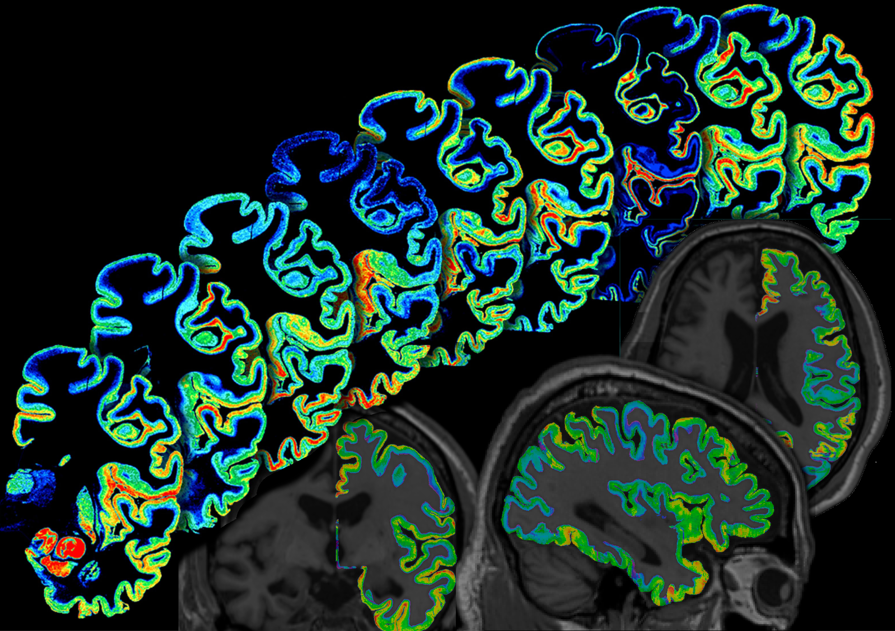
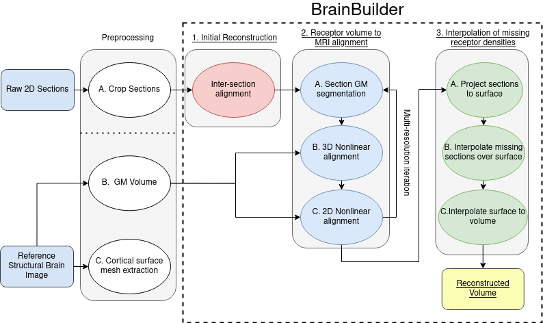
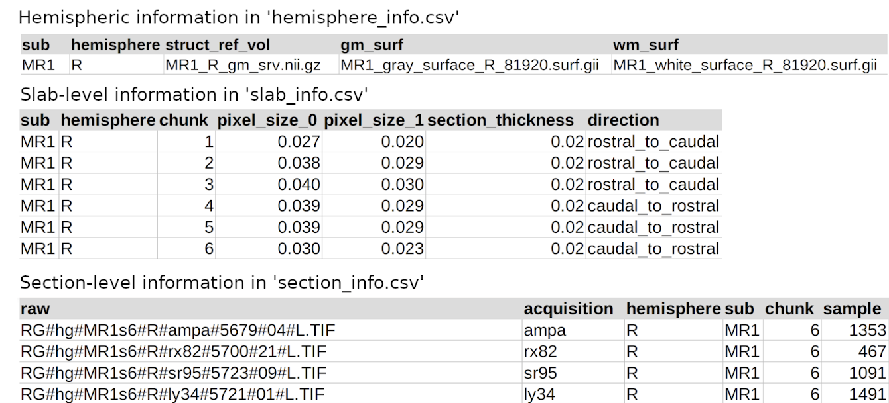

# BrainBuilder

[](https://github.com/tfunck/brainbuilder/blob/main/LICENSE)
[](https://github.com/astral-sh/ruff)
[](documentation/html/brainbuilder/index.html)


### Purpose
BrainBuilder is a software packagefor reconstructing 3-dimensional cortical maps from data sets of 2-dimensional post-mortem serial brain sections processed for the quantification of multiple different biological components.



## Installation

```
python3 -m pip install -e .
```

## Useage

```python3
from brainbuilder.reconstruct import reconstruct


reconstruct('hemi_info.csv', 'chunk_info.csv', 'sect_info.csv', resolution_list=[4,3,2,1], '/output/dir/')
```

### About
BrainBuilder is composed of 3 major processing stages:
1) An initial volume is created by rigid 2D inter-section alignment of acquired sections.
2) An iterative multi-resolution alignment scheme that alternates between 3D volumetric followed by 2D section-wise alignment of the sections to the reference structural brain image (e.g., donor's T1w MRI). The alignment between the reconstructed volume and the reference structural volume is performed using binary GM volumes derived from each of these data sets, respectively. The problem of aligning a volume composed of heterogeneous pixel intensities to a reference volume with an entirely different pixel intensity distribution is thus simplified to mono-modal alignment between GM volumes. 
3) Morphologically informed surface-based interpolation is used to estimate missing pixel intensities for locations where a type of section was not acquired.



### Inputs 

BrainBuilder requires information about the 2D image sections and the tissue chunks and brain hemispheres from which they were acquired. This information is contained in 3 separate .csv files with the following manadatory and optional columns.





### Hemisphere Info
This .csv file contains the information specifying the essential information for each hemisphere to be reconstructed. 

#### Mandatory fields: 
**sub** : subject id

**hemisphere** : hemisphere

**struct_ref_vol** : path to structural reference volume

**gm_surf** : path to gray matter surface file (.surf.gii or .pial)

**wm_surf** : path to white matter surface file (.surf.gii or .pial)

### Chunk Info
This .csv file contains the information for each tissue chunk from which the images are acquired.

#### Mandatory fields
**sub** : subject id

**hemisphere** : hemisphere

**chunk** : id for the tissue chunk (aka slab) 

**pixel_size_0** : pixel size in the x dimension (mm)

**pixel_size_1** : pixel size in the z dimension (mm)

**section_thickness** : thickness of the section (mm)

**direction** : the direction of sectioning for the slab

#### Optional Info
**caudal_limit** : float, the spatial coordinate of the caudal limit of the tissue on the reference template

**rostral_limit** : float, the spatial coordinate of the rostral limit of the tissue on the reference template

### Section Info
This .csv contains information specific to each image file that will be used in the reconstruction. For some modalities, a \<conversion factor\> may be provided to convert grey matter pixel intensities to a quantitative biological parameter. 

#### Mandatory Fields

**sub** : subject id

**hemisphere** : hemisphere

**chunk** : id for the tissue chunk (aka slab) 

**sample** : integer sample number that indicates the order of the section within the data set

**acquisition** : the kind of acquisition (e.g., autoradiography ligand or histological staining)

**raw** : path to the raw section (.nii.gz)

## References
Funck, T., et al. (2020). 3D reconstruction of ultra-high resolution neurotransmitter receptor atlases in human and non-human primate brains. bioRxiv. [https://doi.org/10.1101/2022.11.18.517039](https://www.biorxiv.org/content/10.1101/2022.11.18.517039v1)
