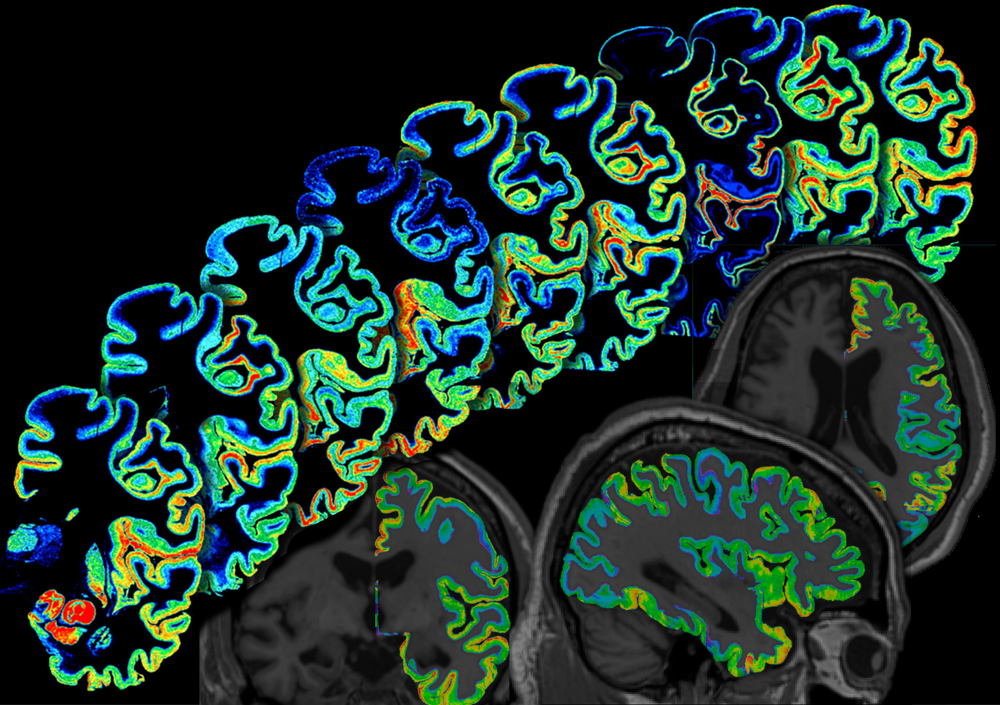
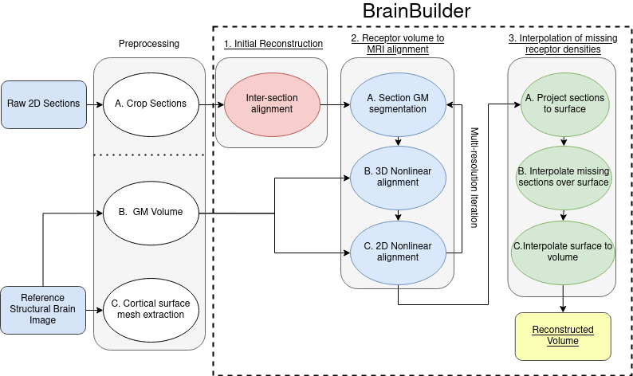

# BrainBuilder

[](https://github.com/tfunck/brainbuilder/blob/main/LICENSE)
[](https://github.com/astral-sh/ruff)
[](documentation/html/brainbuilder/index.html)


BrainBuilder reconstructs 3D volumes from sparse 2D post-mortem brain sections by combining section-wise alignment, 3D registration to a structural reference, and missing-section interpolation.



## What It Does

BrainBuilder performs three main stages:

1. Initial rigid 2D alignment to build a first 3D volume for each chunk.
2. Multi-resolution refinement that alternates 3D chunk-to-reference alignment with 2D section-to-reference alignment.
3. Interpolation of missing sections, with volumetric interpolation as the default and surface-based interpolation available when cortical surfaces are provided.



## Installation

### Requirements

1. Install ANTs. Use the official binaries and follow the ANTs installation guide:
   https://github.com/ANTsX/ANTs/releases

2. Install Python dependencies:

```bash
python3 -m pip install -r requirements.txt
```

3. Install BrainBuilder:

```bash
python3 -m pip install -e .
```

4. Install the bundled `morphint` package:

```bash
cd morphint
python3 -m pip install -e .
```

## Quick Start

```python
from brainbuilder.reconstruct import reconstruct

reconstruct(
    "hemi_info.csv",
    "chunk_info.csv",
    "sect_info.csv",
    resolution_list=[4, 3, 2, 1],
    output_dir="/path/to/output",
)
```

For a first test run, use conservative settings that are fast and require the fewest inputs:

```python
reconstruct(
    "hemi_info.csv",
    "chunk_info.csv",
    "sect_info.csv",
    resolution_list=[4, 2],
    output_dir="/path/to/output",
    interp_method="volumetric",
    num_cores=1,
    base_lin_itr_2d=25,
    base_nl_itr_2d=10,
    base_lin_itr_3d=25,
    base_nl_itr_3d=10,
)
```

Key runtime controls include:

- `resolution_list`: multi-resolution schedule.
- `interp_method`: `volumetric` or `surface`.
- `use_syn`: enable 2D nonlinear alignment.
- `use_3d_syn_cc`: enable 3D SyN with CC.
- `base_lin_itr_2d`, `base_nl_itr_2d`, `base_lin_itr_3d`, `base_nl_itr_3d`: iteration budgets for alignment.

## Input Files

BrainBuilder expects three CSV files describing hemispheres, chunks, and sections.

### Minimal Example

`hemi_info.csv`

| sub | hemisphere | struct_ref_vol |
| --- | --- | --- |
| donor01 | L | /data/donor01_L_T1w.nii.gz |

`chunk_info.csv`

| sub | hemisphere | chunk | section_thickness |
| --- | --- | --- | --- |
| donor01 | L | 1 | 0.02 |

`sect_info.csv`

| sub | hemisphere | chunk | acquisition | raw | sample |
| --- | --- | --- | --- | --- | --- |
| donor01 | L | 1 | receptor_A | /data/sections/sec_0001.nii.gz | 0 |
| donor01 | L | 1 | receptor_A | /data/sections/sec_0002.nii.gz | 1 |

### Full Example

`hemi_info.csv`

| sub | hemisphere | struct_ref_vol | gm_surf | wm_surf |
| --- | --- | --- | --- | --- |
| donor01 | L | /data/donor01_L_T1w.nii.gz | /data/surfaces/donor01_L_gm.surf.gii | /data/surfaces/donor01_L_wm.surf.gii |

`chunk_info.csv`

| sub | hemisphere | chunk | section_thickness | section_axis | caudal_limit | rostral_limit | ref_landmark |
| --- | --- | --- | --- | --- | --- | --- | --- |
| donor01 | L | 1 | 0.02 | 1 | -24.0 | 18.0 | /data/landmarks/ref_landmarks_chunk1.nii.gz |

`sect_info.csv`

| sub | hemisphere | chunk | acquisition | raw | sample | landmark |
| --- | --- | --- | --- | --- | --- | --- |
| donor01 | L | 1 | receptor_A | /data/sections/sec_0001.nii.gz | 0 | /data/landmarks/sec_0001_labels.nii.gz |
| donor01 | L | 1 | receptor_A | /data/sections/sec_0002.nii.gz | 1 | /data/landmarks/sec_0002_labels.nii.gz |

### `hemi_info.csv`

One row per hemisphere.

Required columns:

- `sub`: subject identifier.
- `hemisphere`: hemisphere label.
- `struct_ref_vol`: path to the structural reference volume.

Optional columns:

- `gm_surf`: gray-matter surface. Only needed for surface-based interpolation.
- `wm_surf`: white-matter surface. Only needed for surface-based interpolation.

Notes:

- Surface files are no longer required for the default volumetric interpolation workflow.

### `chunk_info.csv`

One row per tissue chunk or slab.

Required columns:

- `sub`: subject identifier.
- `hemisphere`: hemisphere label.
- `chunk`: chunk identifier.
- `section_thickness`: section thickness in mm.

Optional columns:

- `section_axis`: axis along which sections were acquired. Accepts `0/1/2` or `x/y/z`. Default is `1` (coronal).
- `caudal_limit`: caudal chunk limit in reference-space coordinates.
- `rostral_limit`: rostral chunk limit in reference-space coordinates.
- `ref_landmark`: path to a reference landmark volume for landmark-guided chunk localization.

Deprecated columns:

- `direction`
- `pixel_size_0`
- `pixel_size_1`

### `sect_info.csv`

One row per acquired section image.

Required columns:

- `sub`: subject identifier.
- `hemisphere`: hemisphere label.
- `chunk`: chunk identifier.
- `acquisition`: acquisition or modality label.
- `raw`: path to the section image.
- `sample`: integer section order within the chunk.

Optional columns:

- `landmark`: path to a 2D landmark label image for landmark-based alignment.

Notes:

- `sample` defines section order within a chunk. Smaller values are treated as earlier sections along the sectioning axis.
- `raw` must point to a readable image volume or image file.

## Before You Run

- Make sure `sub`, `hemisphere`, and `chunk` match across all three CSV files.
- Set `section_axis` in `chunk_info.csv` if sections are not coronal.
- Use `interp_method="volumetric"` unless you explicitly want surface-based interpolation and have valid `gm_surf` and `wm_surf` files.
- If you are not using landmarks, omit `landmark_dir`, `ref_landmark`, and `landmark`.
- Start with a short `resolution_list` and low iteration counts to verify that the pipeline runs end-to-end on your data.

## Optional Features

### Surface-Based Interpolation

Set `interp_method="surface"` to use cortical-surface interpolation. This requires `gm_surf` and `wm_surf` in `hemi_info.csv`. If surfaces are provided and there are multiple chunks in the data, then surface interpolation will be used by default to stitch together the chunks along the cortex.

### Landmark-Guided Alignment

Landmark-assisted chunk localization is optional. To use it:

- pass `landmark_dir` to `reconstruct()`;
- provide `ref_landmark` in `chunk_info.csv`;
- provide `landmark` in `sect_info.csv` for sections with 2D landmark labels.

## Outputs

The main output directories are:

- `0_downsample`: input sections resampled to reconstruction resolution.
- `1_seg`: section segmentations.
- `2_init_align`: initial 2D rigid alignment outputs and the first reconstructed chunk volumes.
- `3_multires_align`: per-resolution alignment outputs, including intermediate volumes, 3D transforms, and 2D refined sections.
- `4_interp`: interpolated volumes and final reconstructed chunk outputs.
- `qc`: quality-control outputs.

### Primary Output Files

`2_init_align`

- `initalign_chunk_info.csv`: chunk-level summary after initial alignment, including the first reconstructed volume for each chunk.
- `initalign_sect_info.csv`: section-level summary after initial alignment, including per-section initial 2D transforms.

`3_multires_align`

- `sect_info_multiresolution_alignment.csv`: final section-level table after multi-resolution alignment.
- `chunk_info_multiresolution_alignment.csv`: final chunk-level table after multi-resolution alignment.
- `nl_3d_tfm_fn`: final composite 3D transform for a chunk, mapping chunk space to reference space.
- `nl_3d_tfm_list`: full 3D transform chain when an initial landmark transform is also used.
- `ref_3d_rsl_fn`: chunk volume after final 3D alignment on the reference grid.
- `nl_2d_vol_fn`: reconstructed chunk volume after the final 2D section-wise refinement.
- `nl_2d_vol_cls_fn`: segmentation/classification version of `nl_2d_vol_fn`.
- `2d_tfm`: final per-section 2D transform written in the section-level CSV.
- `2d_tfm_affine`: final per-section affine component written in the section-level CSV.

`4_interp`

- `reconstructed_chunk_info.csv`: main chunk-level summary for downstream use.
- `interp_nat`: interpolated chunk volume in native chunk space.
- `interp_stx`: interpolated chunk volume in reference space.
- `reconstructed_filename`: final reconstructed hemisphere-level volume when chunk outputs are combined.
- `reconstructed_smoothed_filename`: smoothed version of the final reconstructed volume when generated by the interpolation workflow.

The most useful summary files are the CSV outputs written after each stage, especially `3_multires_align/sect_info_multiresolution_alignment.csv`, `3_multires_align/chunk_info_multiresolution_alignment.csv`, and `4_interp/reconstructed_chunk_info.csv`.

For a first pass, these are usually the best files to inspect:

- `2_init_align/initalign_chunk_info.csv`: confirms that initial chunk volumes were built.
- `3_multires_align/chunk_info_multiresolution_alignment.csv`: confirms final 3D and 2D alignment outputs.
- `4_interp/reconstructed_chunk_info.csv`: confirms the final interpolated volumes and gives the output paths to use downstream.

## Documentation

- API docs: `documentation/html/brainbuilder/index.html`
- `morphint` package: `morphint/README.md`

## Reference

Funck, T., Wagstyl, K., Lepage, C. et al. Brainbuilder: a software pipeline for 3D reconstruction of cortical maps from multi-modal 2D data sets. Commun Biol 8, 1015 (2025). https://doi.org/10.1038/s42003-025-08267-6
